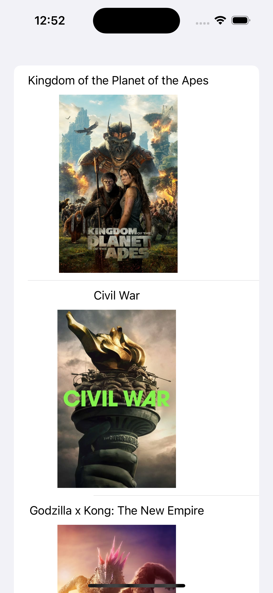

# Image List Loader #

This is a demonstration of a list view in which each row will attempt to download an image, and if an image is being downloaded suddenly goes out of screen (say, if the user scrolls down the page), then that image that is being downloaded will be cancelled.

**Technologies used:** Swift 5, SwiftUI, RESTful API
  

**API used:** The Movie database

**Screenshots:**

 